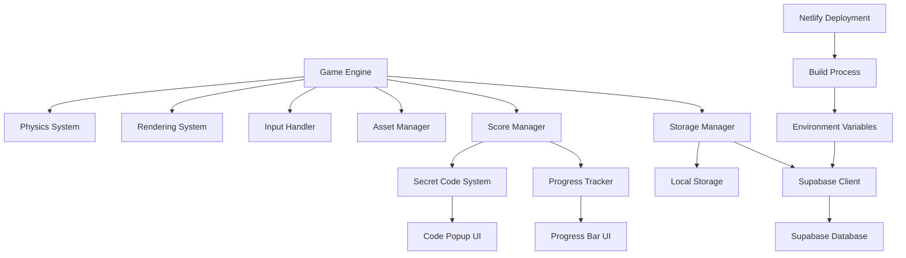

# Design Document

## Overview

The Crypto Meme Suika game is a modified version of the popular Suika/Watermelon game, themed specifically around XRP (XRPL) ecosystem and culture. Players will drop and merge XRP-related tokens and community memes instead of fruits, with the goal of creating larger and more significant XRP ecosystem elements and achieving high scores. A unique feature of this game is the secret code reveal system, which will unlock exclusive content when players reach specific score milestones.

## Architecture

The game will maintain the core architecture of the original Suika game, which uses Matter.js for physics simulation and vanilla JavaScript for game logic. We'll extend this architecture to include:

1. **Asset Management System**: For handling crypto-themed images and sounds
2. **Score Tracking System**: Enhanced to track progress toward secret code unlocks
3. **Secret Code System**: For revealing and managing secret codes at score thresholds
4. **Database System**: Using Supabase for persisting high scores, unlocked codes, and game state
5. **Deployment System**: Configured for Netlify deployment

### System Components Diagram



## Components and Interfaces

### Game Engine

The core game engine will be maintained from the original implementation, with modifications to support the new theme and features:

```javascript
const Game = {
  // Existing properties
  width: 640,
  height: 960,
  
  // New properties
  secretCodes: [
    { threshold: 100, code: "TOTHEMOON", revealed: false },
    { threshold: 500, code: "DIAMONDHANDS", revealed: false },
    { threshold: 1000, code: "HODLGANG", revealed: false },
    { threshold: 2500, code: "XRPWHALE", revealed: false },
    { threshold: 5000, code: "CRYPTOGOD", revealed: false }
  ],
  
  // Progress tracking
  progressToNextCode: 0,
  nextCodeThreshold: 100,
  
  // Methods to be implemented
  checkSecretCodeUnlock: function() { /* ... */ },
  showSecretCodePopup: function(codeIndex) { /* ... */ },
  updateProgressBar: function() { /* ... */ },
  // ...
}
```

### Asset Manager

The Asset Manager will handle loading and managing crypto-themed images and sounds:

```javascript
// Asset paths and configuration
Game.cryptoTokens = [
  { radius: 24,  scoreValue: 1,  img: './assets/img/token0.png', name: "Baby Ripple" },
  { radius: 32,  scoreValue: 3,  img: './assets/img/token1.png', name: "XRP Coin" },
  { radius: 40,  scoreValue: 6,  img: './assets/img/token2.png', name: "Rocket Fuel" },
  { radius: 56,  scoreValue: 10, img: './assets/img/token3.png', name: "Diamond Hands" },
  { radius: 64,  scoreValue: 15, img: './assets/img/token4.png', name: "HODL Shield" },
  { radius: 72,  scoreValue: 21, img: './assets/img/token5.png', name: "Crypto Whale" },
  { radius: 84,  scoreValue: 28, img: './assets/img/token6.png', name: "Rocket Launch" },
  { radius: 96,  scoreValue: 36, img: './assets/img/token7.png', name: "Moon Base" },
  { radius: 128, scoreValue: 45, img: './assets/img/token8.png', name: "Crypto Galaxy" },
  { radius: 160, scoreValue: 55, img: './assets/img/token9.png', name: "Interstellar XRP" },
  { radius: 192, scoreValue: 66, img: './assets/img/token10.png', name: "Crypto God" }
];

Game.sounds = {
  click: new Audio('./assets/crypto-click.mp3'),
  pop0: new Audio('./assets/crypto-pop0.mp3'),
  // ... more sounds
};
```

### Secret Code System

The Secret Code System will manage the unlocking, display, and storage of secret codes:

```javascript
Game.secretCodeSystem = {
  checkUnlock: function(score) {
    // Check if any codes should be unlocked based on score
  },
  
  revealCode: function(codeIndex) {
    // Show popup with the secret code
  },
  
  copyToClipboard: function(code) {
    // Copy code to clipboard
  },
  
  shareCode: function(code) {
    // Share code on social media
  }
};
```

### Progress Tracker

The Progress Tracker will visualize progress toward the next secret code:

```javascript
Game.progressTracker = {
  updateProgressBar: function(score) {
    // Update the progress bar based on current score
  },
  
  resetProgressBar: function(nextThreshold) {
    // Reset progress bar for next threshold
  },
  
  pulseEffect: function() {
    // Visual effect when approaching threshold
  }
};
```

### Storage Manager

The Storage Manager will handle saving and loading game state using both local storage (for offline play) and Supabase (for online persistence):

```javascript
Game.storageManager = {
  supabase: null,
  
  initSupabase: function() {
    // Initialize Supabase client with environment variables
    this.supabase = createClient(
      import.meta.env.VITE_SUPABASE_URL,
      import.meta.env.VITE_SUPABASE_ANON_KEY
    );
  },
  
  saveGameState: function() {
    // Save to local storage
    localStorage.setItem('xrp-game-cache', JSON.stringify(Game.cache));
    
    // Save to Supabase if authenticated
    if (this.supabase && Game.playerID) {
      this.supabase
        .from('game_states')
        .upsert({
          player_id: Game.playerID,
          high_score: Game.cache.highscore,
          unlocked_codes: Game.cache.unlockedCodes,
          last_played: new Date().toISOString()
        });
    }
  },
  
  loadGameState: function() {
    // First load from local storage
    const localData = localStorage.getItem('xrp-game-cache');
    if (localData) {
      Game.cache = JSON.parse(localData);
    }
    
    // Then try to load from Supabase if authenticated
    if (this.supabase && Game.playerID) {
      this.supabase
        .from('game_states')
        .select('*')
        .eq('player_id', Game.playerID)
        .single()
        .then(({ data, error }) => {
          if (!error && data && data.high_score > Game.cache.highscore) {
            Game.cache.highscore = data.high_score;
            Game.cache.unlockedCodes = data.unlocked_codes;
            // Save the merged state back to local storage
            localStorage.setItem('xrp-game-cache', JSON.stringify(Game.cache));
          }
        });
    }
  },
  
  resetGameState: function() {
    // Reset game state for new game
    Game.cache = { highscore: 0, unlockedCodes: [false, false, false, false, false] };
    localStorage.setItem('xrp-game-cache', JSON.stringify(Game.cache));
  }
};
```

## Data Models

### Game State

```javascript
const gameState = {
  highScore: 0,
  unlockedCodes: [false, false, false, false, false],
  lastPlayedDate: Date.now()
};
```

### Secret Code

```javascript
const secretCode = {
  threshold: 1000,
  code: "HODLGANG",
  revealed: false,
  dateUnlocked: null
};
```

### Token (Meme Coin)

```javascript
const token = {
  id: 2,
  name: "Rocket Fuel",
  radius: 40,
  scoreValue: 6,
  imgPath: "./assets/img/token2.png"
};
```

## Error Handling

1. **Asset Loading Errors**: Implement fallback images and sounds if crypto-themed assets fail to load
2. **Local Storage Errors**: Handle cases where local storage is unavailable or corrupted
3. **Physics Simulation Errors**: Implement recovery mechanisms for physics anomalies
4. **Code Popup Errors**: Ensure game state is preserved if code popup display fails

Error handling will follow this pattern:

```javascript
try {
  // Attempt operation
} catch (error) {
  console.error("Error in operation:", error);
  // Implement fallback behavior
  Game.showErrorMessage("Something went wrong. Game state preserved.");
}
```

## Testing Strategy

### Unit Testing

1. **Secret Code System**: Test code unlocking logic at various score thresholds
2. **Progress Tracker**: Test progress calculation and visualization
3. **Storage Manager**: Test saving and loading game state

### Integration Testing

1. **Game Flow**: Test the complete game flow from start to finish
2. **Score and Code Interaction**: Test score calculation and code unlocking integration
3. **UI and Game Logic**: Test interaction between UI elements and game logic

### User Testing

1. **Playability**: Test game feel and responsiveness
2. **Theme Consistency**: Ensure crypto theme is consistent throughout
3. **Secret Code Experience**: Test the excitement and reward feeling of unlocking codes

## Implementation Considerations

1. **Performance**: Maintain 60fps performance on modern browsers
2. **Mobile Compatibility**: Ensure responsive design works on mobile devices
3. **Asset Optimization**: Optimize crypto-themed images for fast loading
4. **Code Organization**: Maintain clean separation of concerns between game systems
5. **Accessibility**: Ensure game is accessible to users with disabilities

## Deployment Strategy

### Netlify Deployment

The game will be deployed to Netlify using the following approach:

1. **Build Configuration**: Set up a `netlify.toml` file with build commands and environment variable references
2. **Environment Variables**: Configure Supabase URL, API keys, and Ideogram API key as environment variables in Netlify
   ```
   # Netlify environment variables
   VITE_SUPABASE_URL=your_supabase_url
   VITE_SUPABASE_ANON_KEY=your_supabase_anon_key
   IDEOGRAM_API_KEY=QIX2yPBqTSSjSVPtjsayIM9o87KaxtPW4c-QvcI_VMCVdKiWM91b-EFjQoMErS7z8QTuQDlEASZ8YnBylL6QZA
   ```
3. **Continuous Deployment**: Connect the GitHub repository to Netlify for automatic deployments
4. **Custom Domain**: Configure a custom domain if needed
5. **Build Optimization**: Optimize assets and implement caching strategies

### Supabase Database Schema

The Supabase database will include the following tables:

1. **game_states**: Store player game states
   - `player_id` (primary key): Unique identifier for the player
   - `high_score`: Player's highest score
   - `unlocked_codes`: Array of unlocked secret codes
   - `last_played`: Timestamp of last play session

2. **leaderboard**: Global leaderboard
   - `id` (primary key): Auto-incrementing ID
   - `player_id`: Foreign key to player
   - `player_name`: Display name of the player
   - `score`: Score achieved
   - `created_at`: When the score was recorded

## Asset Generation Strategy

### Ideogram API Integration

For generating high-quality XRP ecosystem token images, we'll use the Ideogram 3.0 API with the following approach:

1. **API Configuration**:
   ```javascript
   // Store API key securely in environment variables
   // API Key: QIX2yPBqTSSjSVPtjsayIM9o87KaxtPW4c-QvcI_VMCVdKiWM91b-EFjQoMErS7z8QTuQDlEASZ8YnBylL6QZA
   
   const generateImage = async (prompt) => {
     const formData = new FormData();
     formData.append('prompt', prompt);
     formData.append('rendering_speed', 'QUALITY');
     formData.append('style_type', 'DESIGN');
     formData.append('resolution', '1024x1024'); // Consistent size for tokens
     
     const response = await fetch('https://api.ideogram.ai/v1/ideogram-v3/generate', {
       method: 'POST',
       headers: {
         'Api-Key': process.env.IDEOGRAM_API_KEY || 'QIX2yPBqTSSjSVPtjsayIM9o87KaxtPW4c-QvcI_VMCVdKiWM91b-EFjQoMErS7z8QTuQDlEASZ8YnBylL6QZA'
       },
       body: formData
     });
     
     return await response.json();
   };
   ```

2. **Token Image Prompts**:
   - Baby Ripple: "A cute tiny blue ripple in water with cartoon eyes and smile, circular token design, white background, game icon style"
   - XRP Coin: "XRP cryptocurrency coin with cool sunglasses and smirking face, circular token design, white background, game icon style"
   - Rocket Fuel: "Rocket fuel canister with XRP logo and blue flames, circular token design, white background, game icon style"
   - Diamond Hands: "Blue diamond-encrusted hands holding XRP coin, circular token design, white background, game icon style"
   - HODL Shield: "Medieval shield with HODL text and XRP emblem, blue and silver colors, circular token design, white background, game icon style"
   - Crypto Whale: "Cartoon blue whale with XRP symbols on its body, circular token design, white background, game icon style"
   - Rocket Launch: "Rocket with XRP logo blasting off with blue flames, circular token design, white background, game icon style"
   - Moon Base: "Lunar base with XRP flag planted on surface, Earth visible in background, circular token design, white background, game icon style"
   - Crypto Galaxy: "Spiral galaxy with stars and nebula forming XRP symbol, cosmic blue colors, circular token design, white background, game icon style"
   - Interstellar XRP: "Massive glowing XRP symbol as a bright star or sun with planets orbiting around it, cosmic blue and white colors, circular token design, game icon style"
   - Crypto God: "Cosmic deity figure with XRP symbols, controlling the universe with energy beams, blue and purple cosmic colors, circular token design, game icon style"

3. **Image Processing Pipeline**:
   - Download generated images
   - Crop to circular shape
   - Optimize for web
   - Create multiple sizes for different token dimensions

## Future Enhancements

1. **XRP Ledger Integration**: Potential to integrate with actual XRPL for token verification
2. **Multiplayer Mode**: Competitive play against other XRP enthusiasts
3. **Token Market Updates**: Dynamic token values based on real XRP market data
4. **Achievement System**: Additional achievements beyond secret codes
5. **Custom Token Import**: Allow users to import custom token images